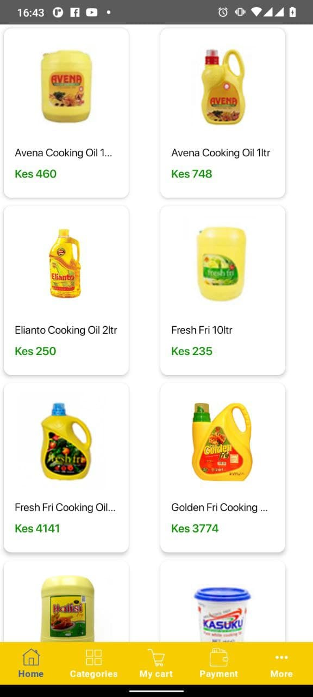

# Kyosk
Sample Android Application

## Table of Contents

- [App](#app)
- [Architecture](#architecture)
- [ScreenShots](#screenshots)
- [Libraries](#libraries)

## App
A demo application showing Shopping categories and product items.
The project has been written in Kotlin language. For network requests, it uses Retrofit with RxJava and Moshi and Room for local caching.
Dagger2 has been used for Dependency injection.

## Architecture
The project is built using the MVVM architectural pattern. Mvvm allows for the separation of concern which also makes testing easier.

## ScreenShots
      
    
    

## Libraries

Libraries used in the whole application are:

- [Viewmodel](https://developer.android.com/topic/libraries/architecture/viewmodel) - Manage UI related data in a lifecycle conscious way 
- [Room](https://developer.android.com/training/data-storage/room) - Provides abstraction layer over SQLite
- [RxJava](https://github.com/ReactiveX/RxJava) - RxJava is a Java VM implementation of Reactive Extensions: a library for composing asynchronous and event-based programs by using observable sequences.
- [Dagger2](https://dagger.dev/dev-guide/) - Used for Dependency injection
- [Retrofit](https://square.github.io/retrofit/) - Turns your HTTP API into a Java interface.
- [Mockito](https://javadoc.io/doc/org.mockito/mockito-core/latest/org/mockito/Mockito.html) - Enables mock creation, verification and stubbing for testing
- [MockWebServer](https://github.com/square/okhttp/tree/master/mockwebserver) - A scriptable web server for testing HTTP clients
- [Glide](https://github.com/bumptech/glide) - Media management and image loading framework for Android
